November 1st 2024
MPAD 2003 - Introductory Data Storytelling
Zhu Lian
Presented to Jean-Sébastien Marier

# Midterm Project: Exploratory Data Analysis (EDA)

## Foreword

In this assignment, I will analyze data extracted from the "2024 Service Requests dataset", an intriguing set of information with plenty to uncover.

## 1. Introduction

This assignment explores a City of Ottawa dataset, accessible on the Open Ottawa portal, to analyze the resolution status of various service requests. Covering issues such as city infrastructure and public transit, the dataset includes 11 fields, from Service Request ID and Status to Channel and Description, with both numerical (e.g., dates) and categorical (e.g., issue types) data. I imported the dataset into Google Sheets for a clearer format, making it easier to explore the relationships and trends within each category.

The original dataset is accessible here: https://open.ottawa.ca/documents/65fe42e2502d442b8a774fd3d954cac5/about, on Open Ottawa, with my cleaned CSV version available on GitHub: https://github.com/jsmarier-courses/midterm-project-Avignon1309/blob/main/Midterm_dataset.csv.

This assignment will be organized into three sections: data collection, data cleaning for clarity, and a basic analysis to uncover patterns and insights that can help with the storytelling of the story behind the data.

## 2. Getting Data

##### To begin analyzing the dataset, I first imported it into Google Sheets, which is very helpful for clearing the format. I followed these steps to import the data:
1.	Find Google Sheets and go to File > Import.
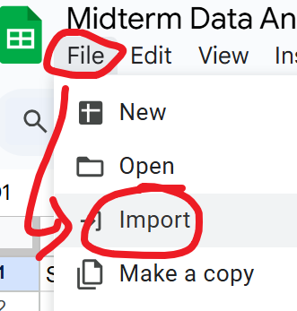
2.	Select Upload and find the CSV file extracted from Open Ottawa.
 
3.	Choose Replace spreadsheet to upload it as a new sheet, ensuring the data begins in cell A1, otherwise the format will be interrupted.
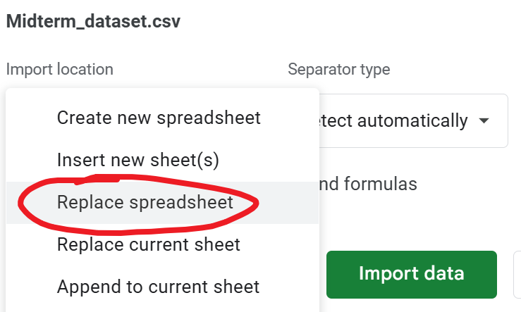 
##### After importing, the dataset would be like this:
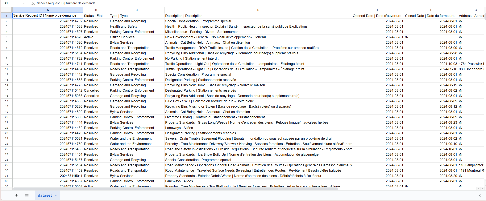 
The public link to this Google Sheets spreadsheet is here: 
https://docs.google.com/spreadsheets/d/1y2qkFr-wPx4Yjkibjxr8ryp7oQOLCHhHAUmfwWnDwZ8/edit?usp=sharing

As we can see, the dataset contains 28539 rows and 11 columns. From a first glance, it appears relatively clean, with most cells populated and formatted consistently. However, I noticed a few potential inconsistencies, especially in column F, H and I. Some of the “\N” are not aligning with others, like "F33", "F36" and "J5".

##### Specific Observations
1.	Column B: [Status] – This column contains categorical variables, representing status like resolved, active and cancelled.
    ###### Observation: The column is complete, clear and concise, nothing is missing.
2.	Column C: [Types] – This column contains different types of the requests, like Garbage and Recycling, Health and Safety.
    ###### Observation: There’s nothing wrong with the format of this column, everything’s in order.
3.	Column F: [Closed Date] – This column includes numerical variables, indicating the closed date of the specific request. 
    ###### Observation: A few dates are represented as “\N” as missing data, raising questions about what’s happening on those days and why the data is missing here.

##### Questions on the data
Looking at the data, one question that comes to my mind is: *In the same type request, are there any correlations between one specific request’s description and its status for being resolved or cancelled?*

For example, for the type of Roads and Transportation, requests with a description of “road maintenance” are mostly tagged with “resolved”, yet most “active” tags have a description of “Traffic Management”. This could reveal how different factors impact city services.

## 3. Understanding Data

### 3.1. VIMO Analysis

First of all, the term “VIMO” stands for “Valid”, “Invalid”, “Missing” and “Outlier”. As the official of Statistics Canada claimed, “Accurate Data is a true reflection of reality”, Valid stands for data that are correct, Invalid is the opposite, Missing stands for values that are blank and Outlier stands for values that are extremely large or small relative to expectations (Canada Statistics, 2020). 

Since my question is about the correlation between one request’s description and its status in the same type, I will have a closer look at column D, which is the description of all requests.

### Valid:
	Definition: values that are correct.
Analysis: all cells are correct as all of them are descriptions of requests.
### Invalid:
	Definition: values that are impossible.
Analysis: all values are correct since there are no numbers or content that are not descriptions.
### Missing:
	Definition: values that are blank.
Analysis: some of the values are represented as “\N”, which is a missing value. There are 628 missing blanks in total, only 2.2% of missing data among the total 28538 lines, which is acceptable.
### Outlier:
	Definition: values that are too big or too small relative to the expectation.
Analysis: all description is about the request’s issue, there’s no outlier value.

In a nutshell, 97.8% of the data in column D are correct and accurate, which are quite useful for exploring its relationship with the requests’ types and status.

### 3.2. Cleaning Data

##### First, I use “adding a filter” to reformat the data by their first letter so that requests of the same type will be put together and they will be sorted with the same description, which is much more direct than before.

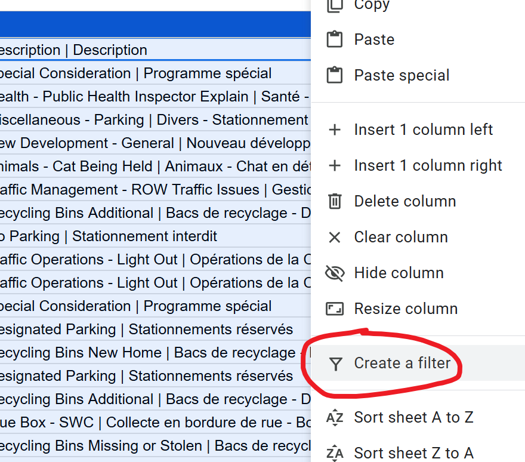 

After adding the filter, now I need to "sort A to Z". (Noted, when adding the filter, must use ctrl+A to select all lines and columns, otherwise the data will be distorted)

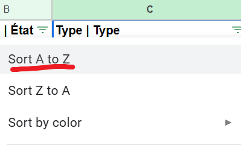 

Before adding the filter, the dataset was like:

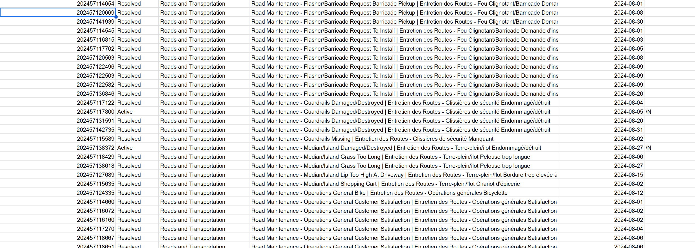 

After adding the filter, the dataset is like:

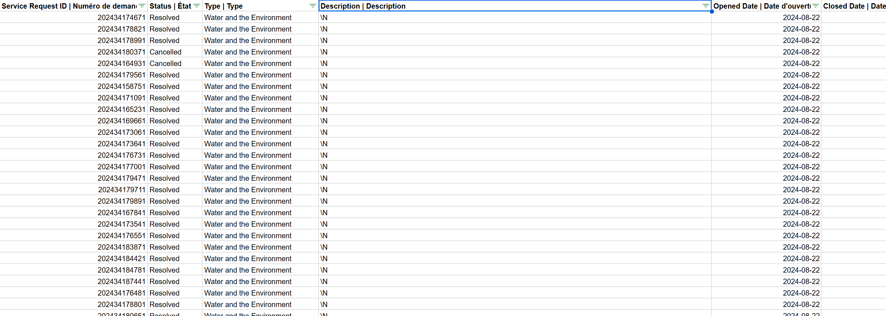 

##### To make sure there’s no duplicate than can interrupt the analysis, I need to use Google Sheets data-cleaning tools to remove possible duplicates.

First, use ctrl+A to select all the data, then go to section “data” at the top, and select “Data Cleanup-remove duplicate”.

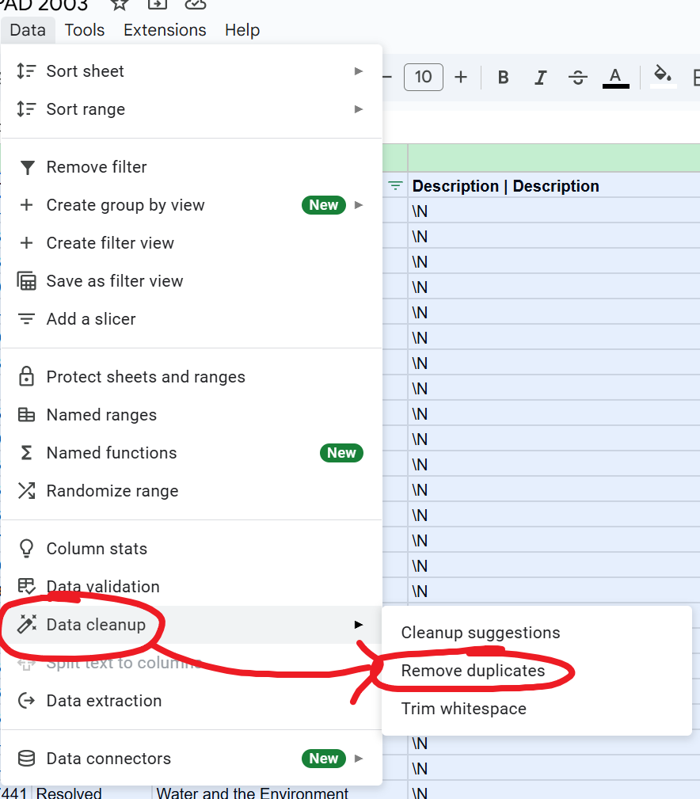 

Then select all the lines and columns in the tool.

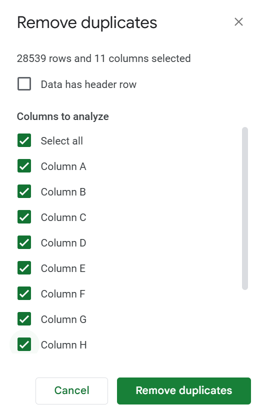 

As it turns out, there’s no duplicate at all, so I don’t have to worry about it. 

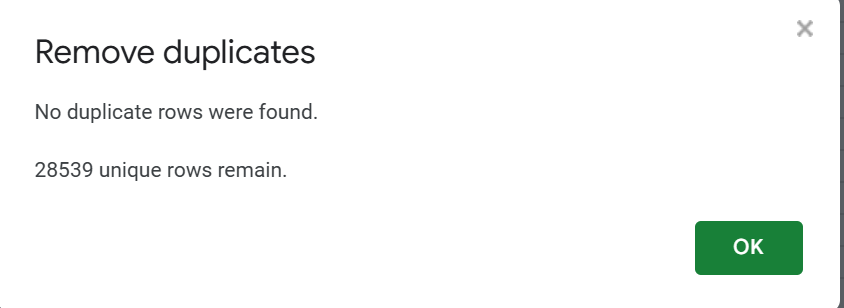 

Also, as there’s no duplicate, the dataset will not change at all.

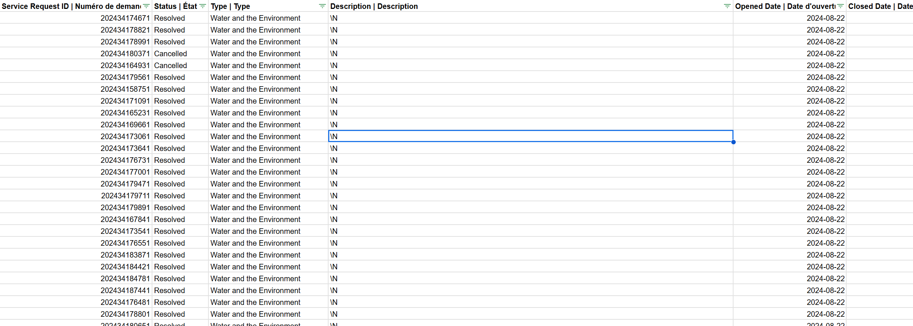 

### 3.3. Exploratory Data Analysis (EDA)

Insert text here.

**This section should include a screen capture of your pivot table, like so:**

 
*Figure 2: This pivot table shows...*

**This section should also include a screen capture of your exploratory chart, like so:**

 
*Figure 3: This exploratory chart shows...*

## 4. Potential Story

Insert text here.

## 5. Conclusion

Insert text here.

## 6. References

Canada Statistics. (2020, September 23). *Data Accuracy and Validation: Methods to ensure the quality of data*. Www.statcan.gc.ca. https://www.statcan.gc.ca/en/wtc/data-literacy/catalogue/892000062020008