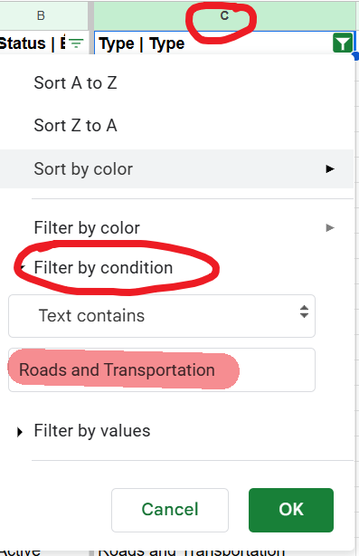
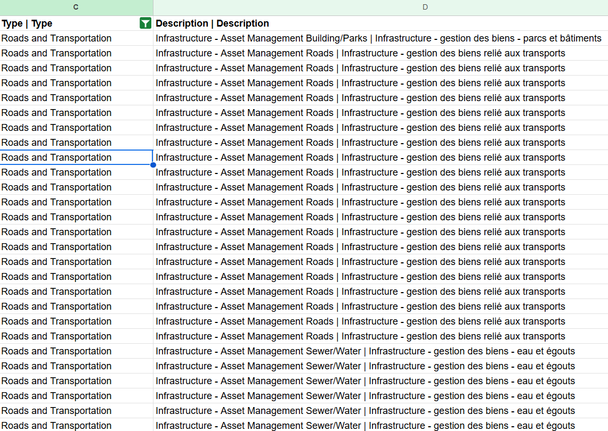
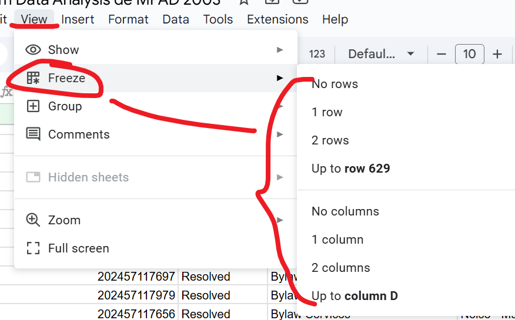
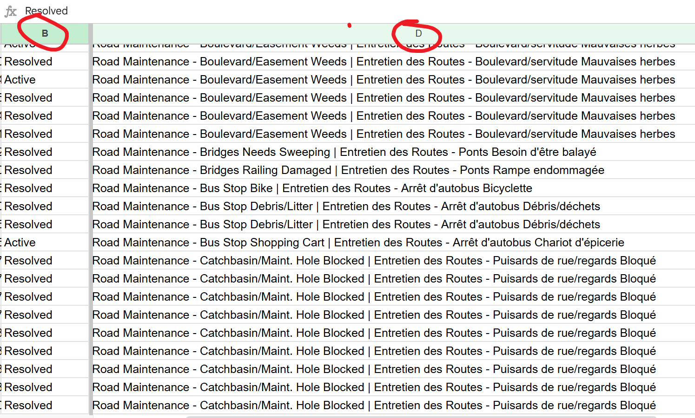
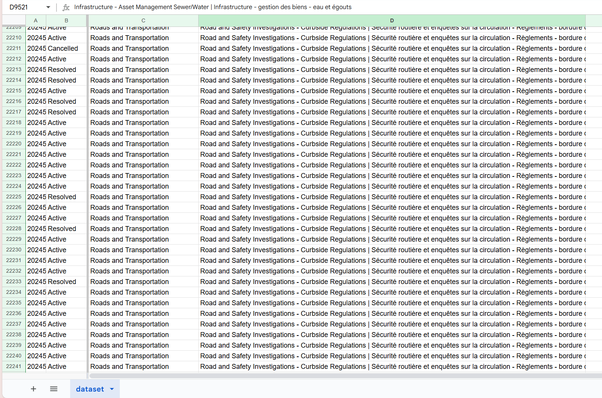
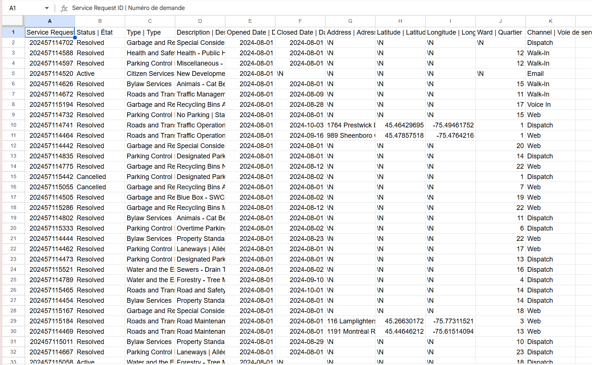
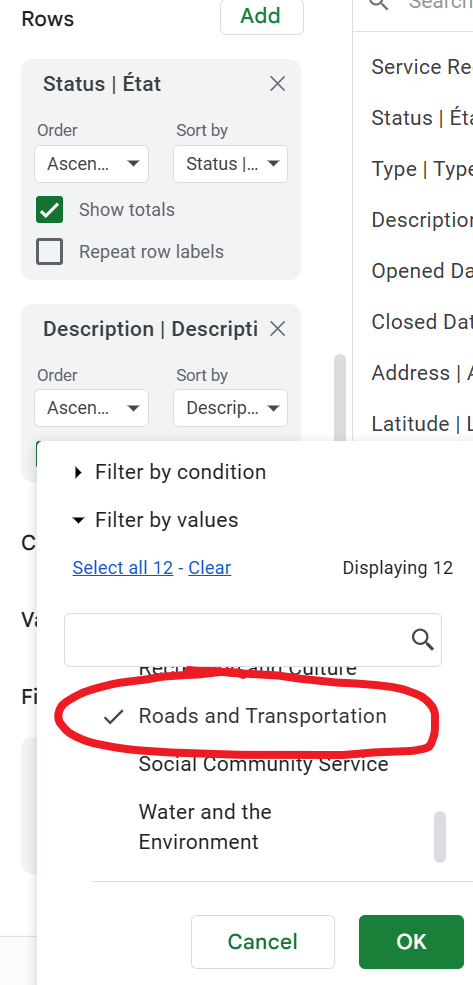
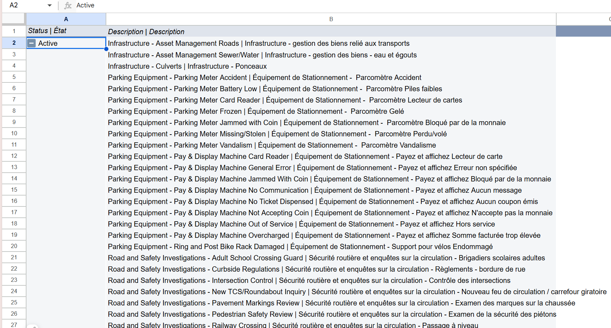
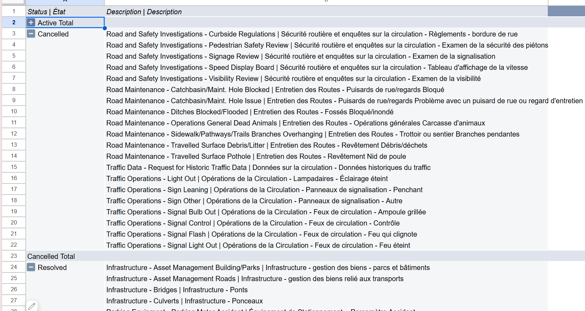
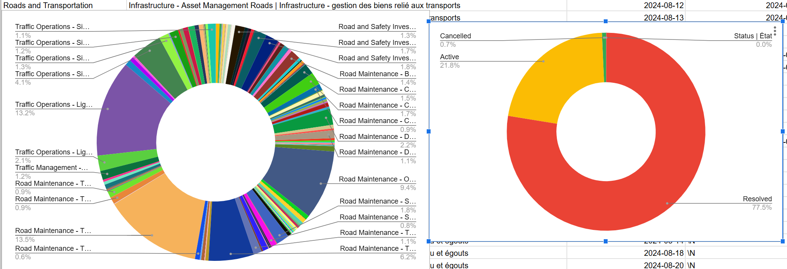

November 1st 2024
MPAD 2003 - Introductory Data Storytelling
Zhu Lian
Presented to Jean-Sébastien Marier

# Midterm Project: Exploratory Data Analysis (EDA)

## Foreword

In this assignment, I will analyze data extracted from the "2024 Service Requests dataset", an intriguing set of information with plenty to uncover.

## 1. Introduction

This assignment explores a City of Ottawa dataset, accessible on the Open Ottawa portal, to analyze the resolution status of various service requests. Covering issues such as city infrastructure and public transit, the dataset includes 11 fields, from Service Request ID and Status to Channel and Description, with both numerical (e.g., dates) and categorical (e.g., issue types) data. I imported the dataset into Google Sheets for a clearer format, making it easier to explore the relationships and trends within each category.

The original dataset is accessible here: https://open.ottawa.ca/documents/65fe42e2502d442b8a774fd3d954cac5/about, on Open Ottawa, with my cleaned CSV version available on GitHub: https://github.com/jsmarier-courses/midterm-project-Avignon1309/blob/main/Midterm_dataset.csv.

This assignment will be organized into three sections: data collection, data cleaning for clarity, and a basic analysis to uncover patterns and insights that can help with the storytelling of the story behind the data.

## 2. Getting Data

##### To begin analyzing the dataset, I first imported it into Google Sheets, which is very helpful for clearing the format. I followed these steps to import the data:
1.	Find Google Sheets and go to File > Import.

2.	Select Upload and find the CSV file extracted from Open Ottawa.
 
3.	Choose Replace spreadsheet to upload it as a new sheet, ensuring the data begins in cell A1, otherwise the format will be interrupted.
 
##### After importing, the dataset would be like this:
 
The public link to this Google Sheets spreadsheet is here: 
https://docs.google.com/spreadsheets/d/1y2qkFr-wPx4Yjkibjxr8ryp7oQOLCHhHAUmfwWnDwZ8/edit?usp=sharing

As we can see, the dataset contains 28539 rows and 11 columns. From a first glance, it appears relatively clean, with most cells populated and formatted consistently. However, I noticed a few potential inconsistencies, especially in column F, H and I. Some of the “\N” are not aligning with others, like "F33", "F36" and "J5".

##### Specific Observations
1.	Column B: [Status] – This column contains categorical variables, representing status like resolved, active and cancelled.
    ###### Observation: The column is complete, clear and concise, nothing is missing.
2.	Column C: [Types] – This column contains different types of the requests, like Garbage and Recycling, Health and Safety.
    ###### Observation: There’s nothing wrong with the format of this column, everything’s in order.
3.	Column F: [Closed Date] – This column includes numerical variables, indicating the closed date of the specific request. 
    ###### Observation: A few dates are represented as “\N” as missing data, raising questions about what’s happening on those days and why the data is missing here.

##### Questions on the data
Looking at the data, one question that comes to my mind is: *In the same type request, are there any correlations between one specific request’s description and its status for being resolved or cancelled?*

For example, for the type of Roads and Transportation, requests with a description of “road maintenance” are mostly tagged with “resolved”, yet most “active” tags have a description of “Traffic Management”. This could reveal how different factors impact city services.

## 3. Understanding Data

### 3.1. VIMO Analysis

First of all, the term “VIMO” stands for “Valid”, “Invalid”, “Missing” and “Outlier”. As the official of Statistics Canada claimed, “Accurate Data is a true reflection of reality”, Valid stands for data that are correct, Invalid is the opposite, Missing stands for values that are blank and Outlier stands for values that are extremely large or small relative to expectations (Canada Statistics, 2020). 

Since my question is about the correlation between one request’s description and its status in the same type, I will have a closer look at column D, which is the description of all requests.

### Valid:
	Definition: values that are correct.
Analysis: all cells are correct as all of them are descriptions of requests.
### Invalid:
	Definition: values that are impossible.
Analysis: all values are correct since there are no numbers or content that are not descriptions.
### Missing:
	Definition: values that are blank.
Analysis: some of the values are represented as “\N”, which is a missing value. There are 628 missing blanks in total, only 2.2% of missing data among the total 28538 lines, which is acceptable.
### Outlier:
	Definition: values that are too big or too small relative to the expectation.
Analysis: all description is about the request’s issue, there’s no outlier value.

In a nutshell, 97.8% of the data in column D are correct and accurate, which are quite useful for exploring its relationship with the requests’ types and status.

### 3.2. Cleaning Data

##### In order to make the dataset look more direct, I plan to use three methods to do the clear-up: "Addng a filter", "Removing Duplicate" and "Freezing rows and columns".

##### First, I use “adding a filter” to reformat the data by their first letter so that requests of the same type will be put together and they will be sorted with the same description, which is much more direct than before.

 

After adding the filter, now I need to "sort A to Z". (Noted, when adding the filter, must use ctrl+A to select all lines and columns, otherwise the data will be distorted)

 

After adding the filter, the dataset is like:

 

Also, since what I'm going to look at is the "Roads and Transportation" type, so I need to change the sorting filter in column C from "A to Z" into "filter by condition - Text contains XXX". 

 

So, when it's filtered as "text contains 'Roads and Transportation'", the dataset will be like:

 

##### To make sure there’s no duplicate than can interrupt the analysis, I need to use Google Sheets data-cleaning tools to remove possible duplicates.

First, use ctrl+A to select all the data, then go to section “data” at the top, and select “Data Cleanup-remove duplicate”.

 

Then select all the lines and columns in the tool.

 

As it turns out, there’s no duplicate at all, so I don’t have to worry about it. 

 

Also, as there’s no duplicate, the dataset will not change at all.

 

##### After doing all the process above, now the dataset looks very extended at the same level with the same type values. To locate the type and the description we need, "freezing rows and columns" is a great way to freeze those important cells we need while scrolling the scren.

Thus, I need to go to the top left and choose "view", "freeze" first. 

 

Since I'm going to compare the status and the description, all I need to do is to freeze column B.

 

Now, I can move freely to compare the status and the description while column B is frozen.

 

##### In the end, after using “adding the filter”, “remove duplicate” and “freezing rows and columns”, my dataset looks like this:

 

Before applying the three methods, the dataset was like:

 

### 3.3. Exploratory Data Analysis (EDA)

##### Now that the dataset is reformatted, I can use a pivot table to uncover trends, patterns, and outliers.

However, while creating a pivot table specifically in type Roads and Transportation, I need to adjust a few things first. Before creating the pivot table, the filter must be selected as “Text Contains”. 

 

After that, at the pivot table settings, the filter should be selected as “Roads and Transportation”, and two rows of “status” and “description” should be activated. To sum up, the pivot table would be like this:

 

 

##### After creating one pivot table, it’s time to have a bar chart using the Google Sheets Chart tool to visually represent the spread of values in description.

Thus, I decide to use donut charts to show the percentage more directly. 

 

##### From the pivot table and the donut charts, I've noticed something interesting.

The reason why I focus on Column D (description) is because it’s directly relevant to the status of being solved or cancelled. Column D likely represents an essential variable like the percentage of Road Maintenance requests in the type of Road and Transportation, which could offer insights into the difficulty in solving different road and transportation requests.

There’s one standout number in the pivot table. I noticed that while all the three statuses (Active, Cancelled and Resolved) have almost all the descriptions, the percentages of the descriptions they have are different. For instance, almost 65% of the Roads and Transportation are requests of road maintenance, and traffic management requests are the fewest. This data suggests that some areas of Roads and Transportation may require more resources compared to others.

After making the charts, I’ve learned that the distribution of different requests in Column D has a correlation with its status. Certain categories like road maintenance show much higher values, hinting that most of the road infrastructure are in a poor situation. This trend could suggest a story about how city resources, especially infrastructures are unevenly spread across Ottawa, possibly tied to specific geographic or economic factors within the city.

## 4. Potential Story

A potential story emerging from this dataset centers on the topic of uneven distribution of resources in infrastructure across the city of Ottawa. The data in Column D shows significant variance, with some areas like traffic operations and road management displaying much lower values than others. This could indicate that certain requests of Roads and Maintenance face greater demands or challenges than others, highlighting potential inequalities in resource allocation or service accessibility.

To tell this story fully, I would need more data on the status of roads, as well as details on city funding and service allocation on infrastructures. Thus, it would be a great idea to interview community leaders, or officials who can provide more information about the daily work of Roads and Transportation affairs. They could explain how these different requests may impact residents’ daily lives.

Researching similar issues on infrastructure can provide more valuable insights on this issue of uneven distribution. While it’s not about roads, the gap of funding between Ottawa and Toronto can also represent the same situation of uneven distribution on infrastructure (Skura, 2024). Similar cases like the animal-car collisions can explain more on this unequal distribution on road transportation as each place has their own situation (Graveland, 2024)

## 5. Conclusion

This assignment involved all the modules of data analysis we had before, from importing and cleaning the data to performing exploratory analysis and considering potential stories. This process is really interesting to me because data can always inform me something I have no idea before. One of the most challenging aspects during this process was sorting the data in the same category because in column D, there are a plenty of different sub-types that are under the same sub-category like Road Maintenance, which includes different types of requests. Additionally, making meaningful observations from raw data and deciding which values to focus on required careful thought to avoid overlooking important patterns, but it’s worthy to spend time on it.

The most rewarding aspect of this assignment was discovering the potential story that emerged from the data. Identifying trends and considering how to add additional sources and interviews made the data feel more dynamic and relevant to reality concerns in Ottawa. 

As for me, understanding more advanced data-cleaning tools like OpenRefine or function methods could enhance my ability to handle large datasets with greater efficiency. The reason why I didn’t use OpenRefine this time is because I’m not truly an expert in it, which can be improved in the future.

In the end, I actually used all the skills I learned from all the modules before in this assignment, and I really enjoy the feeling of putting what I’ve learned into actual use.

## 6. References

Canada Statistics. (2020, September 23). *Data Accuracy and Validation: Methods to ensure the quality of data*. Www.statcan.gc.ca. https://www.statcan.gc.ca/en/wtc/data-literacy/catalogue/892000062020008

Skura, E. (2024, September 15). As transit funding gap between Ottawa and Toronto widens, lobbying revs up. CBC. https://www.cbc.ca/news/canada/ottawa/as-transit-funding-gap-between-ottawa-and-toronto-widens-lobbying-revs-up-1.7323080

Graveland, B. (2024, November 3). “Red patches on the road”: Alberta wildlife corridors reduce animal-car collisions. CBC. https://www.cbc.ca/news/canada/calgary/alberta-crowsnest-pass-wildlife-corridors-1.7372446